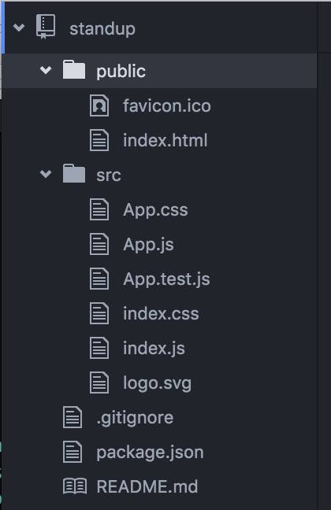
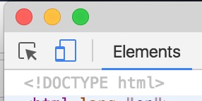
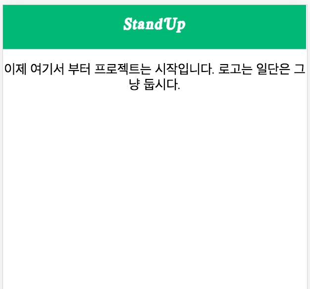
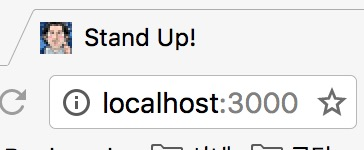
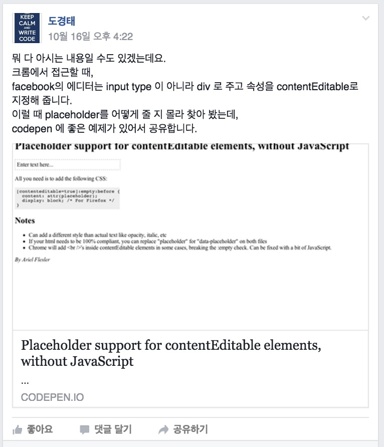
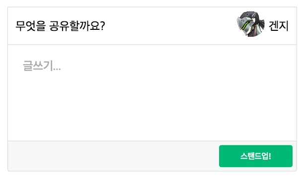
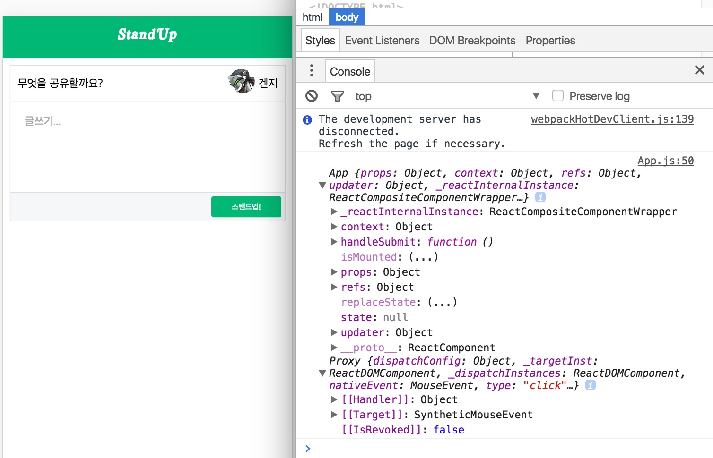

# Day2

Day1에서 Hello World 와도 같은 프로그램을 빌드까지 했다고 하면 Day2에서는 실제 페이지를 만들기 위한 기본 작업들로 시작해서 User Story2번의 기초 작업을 해 보도록 하겠습니다.

일단 처음 만들어진 폴더 구조는 다음과 같습니다.

이후 진행에 폴더를 찾는데 참조하시기 바랍니다.

## 로고, 파비콘(favicon), 헤더

처음 실행한 예제에서 이쁘기는 하지만 무지하게 큰 움직이는 로고를 만나보셨을 겁니다. 그리고 헤더가 엄청나게 큰 영역을 차지하고 있다는 것, 파비콘도 react 이미지라는 사실을 알 수 있죠.

이런 것들을 변경하는 팁을 약간 언급하고 넘어가겠습니다.

### 로고
개발자에게 디자인은 또 다른 어려움일거라 생각합니다.
그래서 [쿨텍스트](http://ko.cooltext.com/) 같은 텍스트를 로고로 변환해 볼까 합니다.
Stand Up으로 주고 헤더 색깔을 녹색( #02B875 )으로 지정할 예정이기 때문에 비슷하게 맞춰서 다운 받아 둡니다.


### favicon
favicon은 브라우저에서 타이틀 텍스트 옆에 있는 작은 아이콘입니다. 즐겨찾기에도 표시가 되는 아이콘인데, 이 것도 만들어주는 사이트가 있습니다.
[favicon-generator](http://www.favicon-generator.org/) 같은 사이트는 그런 역할을 해 주는 군요.
재밌는 것은 이 사이트은 파비콘이 없다는 사실입니다. 저는 제 캐리커쳐를 올려서 favicon을 만들었습니다.


### 헤더
헤더의 색과 사이즈를 변경할 수 있습니다.

src 폴더 아래의 App.css 파일의 CSS 파일을 다음과 같이 고치고
```CSS
.App-logo {
  height: 45px;/* 이미지 사이즈 줄이고*/
}
.App-header {
  background-color: #02B875;/* 타이틀 바 색감을 좀 바꾸고*/
  height: 50px;/* 전체 사이즈를 줄였습니다.*/
  padding: 5px;
  color: white;
}
```

이미지 사이즈를 줄이고, 타이틀 바 색감을 좀 바꾸고, 전체 사이즈를 줄인 결과에 로고 이미지와  favicon 을 바꾸도록 App.js를 바꿔보도록 하겠습니다.

```JavaScript
import React, { Component } from 'react';
import logo from './img/stand_up_logo.png';
import './App.css';

class App extends Component {
  render() {
    return (
      <div className="App">
        <div className="App-header">
          
        </div>
        <p className="App-intro">
          이제 여기서 부터 프로젝트는 시작입니다. 로고는 일단은 그냥 둡시다.
        </p>
      </div>
    );
  }
}
export default App;
```
favicon은 public folder밑에 파일을 대체만 해 주면 됩니다.

지금부터는 모바일 화면 기준으로 보기 위해 개발자 도구의 모바일 보기 기능을 활용하겠습니다.



그럼 다음과 같이 보여야 정상입니다.



파비콘도 정상이네요



## User Story 2

정의된 User Story는 다음과 같습니다.
```
 김개발이 사이트를 방문해서 자신이 어제 유심하게 읽은 글을 올릴 수 있다. 이렇게 하면 다른 사람들이 볼 수 있다.
  * 에디터 창은 하나만 있고 거기서 글을 작성하고 업로드 하면 글이 외부 클라우드 공간에 저장이 된다.
```

유심하게 읽은 글을 올릴 수 있다. 부분을 참조해서 요건을 정의해 봅시다

### 요건 정의

"무엇을 올린 것인가"를 고려해 볼 때 소셜미디어들의 화면을 보도록 하겠습니다.



위의 이미지에서 기본적인 요건을 정의해 보면
```
작성자 (writer)
작성일 (createdAt)
내용 (contents)
링크
    - 링크 이미지
    - 링크 제목
    - 링크 설명
    - 링크 주소
```
등을 기본으로 가지고 있습니다.

## 에디터 작성

그렇다면 Editor에 위의 내용들을 입력해서 업로드하기 직전까지의 작업을 지금부터 해 볼 것입니다. 어디에 어떻게 올릴 것인지는 나중에 고민하기로 하고 가장 쉬운 에디터 부터 만들어 보겠습니다.


와 같은 형태의 에디터를 만들 때 필요한 부분은 사용자 프로파일과 타이틀('무엇을 공유할까요') 부분과 입력부 , 버튼 순등이 있을 거 같습니다.

##### 사용자 프로파일 만들기

지금은 사용자의 세션을 생각하지 말고 Anonymous모드로 먼저 만들어 보도록 하겠습니다.

Profile.js, Profile.css 파일을 아래와 같이 만들어 보겠습니다.
```JavaScript
//profile.js
import React  from 'react';
import './Profile.css';
import Anonymous from './img/anonymous.png';

function Profile(isAnonymous){
  if(isAnonymous){ //익명일 경우
    return(
        <div className="anonymous">
          <div className="today_title">
            무엇을 공유할까요?
          </div>
          <div className="anonymous_name">
          겐지
          </div>
          <div className="anonymous_img_wrap">
            
          </div>
        </div>
    )
  }else{//익명이 아닐 경우는 일단은 빈 div
    return <div/>;
  }
}
export default Profile;
```

```CSS
/*Profile.css*/
.anonymous{
  text-align: left;
  background-color: white;
  border-bottom: 1px solid #dddfe2;
  width :100%;
  height: 50px;
}
.anonymous_img_wrap{
  text-align: right;
  border-radius: 50%;
  display: inline;
  float: right;
}
.anonymous_img{
  border-radius: 50%;
  height: 35px;
  padding: 5px;
}
.anonymous_name{
  padding-right: 10px;
  float: right;
  margin-top: 17px;
}
.today_title{
  float: left;
  margin-top: 17px;
  padding-left: 10px;
}
```

익명일 경우에 겐지는 일단 Username으로 정하겠습니다.
일반 function 함수로 컴포넌트를 만들었고 props 로 isAnonymous 값을 전달 받는다는 사실을 알 수 있습니다.

##### 입력부와 버튼 만들기

이제는 입력부를 살펴 볼까요?

전통적으로 웹 에디터의 입력부 작성하는 방법은

```html
<form target="[some url]">
  <textarea name="[text_area_name]"/>
</form>
```
이지만 몇가지 이유에서 div 태그를 이용하도록 하겠습니다. (form 에 넣을 경우는 브라우저 이벤트가 우리가 넣는 이벤트에 우선하기 때문에 엔터를 칠 경우 submit이 되고, Single Page Applicaion의 경우 URL 이 옮겨지는 등의 제어를 위해 들어가야 하는 스크립트들이 많아지는 것등에 대한 코드가 많아지는 일들이 있습니다.)

div 의 경우는 content-editable 속성을 주면 편집이 가능합니다.
placeholder 까지 더한코드를 살펴보겠습니다. (placeholder란 HTML 입력 폼에서 사용자가 입력하기 전까지 화면에 표시되는 문자열을 이야기 합니다)
```html
<div class="innerEdit"
        contentEditable="true"
        placeholder="글쓰기..."></div>
```
하지만 div는 그냥 placeholder가 작동하지 않습니다. 그래서 innerEdit이라는 CSS클래스르 다음과 같이 작업을 해 줘야 합니다

```CSS
[contenteditable=true]:empty:before{
  content: attr(placeholder);
  color: #aaa;
  display: block; /* For Firefox */
}
```
이제 아까 작성한 Profile.js 를 결합하고 눌렀을 때 동작하는 코드를 만들어 보도록 하겠습니다.(콘솔만 먼저 찍어보도록 하겠습니다.)

Editor.js 및 Editor.css 파일을 아래와 같이 작성해 보겠습니다.

```JavaScript
import React, { Component } from 'react';
import './Editor.css';//Editor.css 파일 임포트
import Profile from './Profile';//Profile 파일 임포트

class Editor extends Component {
  render() {
    return (
      <div className="wrapEditor">
        <Profile isAnonymous={this.props.isAnonymous}/>
        <!-- isAnonymous 값을 props로 받는다.-->
        <div className="textEditor">
          <div className="innerEdit"
            contentEditable="true"
            placeholder="글쓰기..."></div>
        </div>
        <div className="actionBar">
          <button className="upload" onClick={this.props.handleSubmit}>
          <!--버튼 이벤트를 props 값으로 받는다 -->
          <span>스탠드업!</span>
          </button>
        </div>
      </div>
    );
  }
}

export default Editor;
```

```CSS
/*placeholder*/
[contenteditable=true]:empty:before{
  content: attr(placeholder);
  color: #aaa;
  display: block; /* For Firefox */
}
.wrapEditor{
  padding : 0px;
  border: 1px solid #dddfe2;
  margin: 10px;
  border-radius: 0 0 3px 3px;
  background-color: #f6f7f9;
}

.textEditor{
  width:100%;
  min-height: 100px;
  background-color: white;
  border-bottom: 1px solid #dddfe2;
}
.textEditor .innerEdit{
  text-align: left;
  color: #1d2129;
  padding:20px;
  min-height: 90px;
}
.actionBar{
  min-height: 40px;
}
.upload{
  width:100px;
  height: 30px;
  margin: 5px;
  float:right;
  color: white;
  background-color: #02B875;
  border-radius: 3px 3px 3px 3px;
  border: 0px;
}
```

이제 Editor.js 파일을 App.js 파일에 컴포넌트로 완성을 해야 입력 폼이 완성이 된다고 볼 수 있습니다.
(소스에서 이미 확인하셨겠지만 props로 들어오는 값들이 있습니다.)

App.js 파일은 다음과 같이 수정하겠습니다.
```JavaScript
import React, { Component } from 'react';
import logo from './img/stand_up_logo.png';
import './App.css';
import Editor from './Editor'

class App extends Component {
  constructor(){
    super();
    this.handleSubmit = this.handleSubmit.bind(this);
  }
  //버튼을 눌렀을 때 Action. 지금은 일단 콘솔 값을 확인만 함
  handleSubmit(e){
    console.log(this,e);
  }
  //익명 사용자 여부
  isAnonymous(){
    return true;
  }
  render() {
    return (
      <div className="App">
        <div className="App-header">
          
        </div>
        <Editor {...this}/><!-- App의 프로퍼티를 Editor의 props로 전달 -->
      </div>
    );
  }
}

export default App;
```

변경된 소스를 잘 보셨으면 아시겠지만 Editor에 부모가 가진 메쏘드들을 전달하는 패턴을 쓸때 열거형 ```...```
을 사용했습니다. 자주 쓸 경우는 불필요한 리소스들까지도 연결 될 수 있으니 잘 확인해서 사용하시기 바랍니다

이렇게까지 작업을 하면 다음과 같이 페이지가 뜨게 되고 콘솔 값을 확인해 볼 수 있습니다.


다음은 콘솔 값이 아니라 간단한 리스트를 페이지에 찍어보고 Embed.ly를 가지고 카드를 만들어 보도록 하겠습니다.
