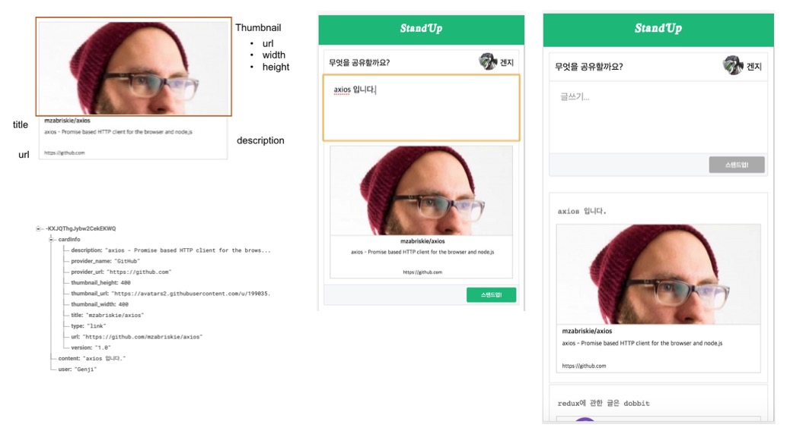

# StandUP!

```
애자일 프랙티스 standup 할 때 아이스브레이킹에 사용되는 IT기술에 관련된 주제를 나눌 수 있는 아티클들을 공유하는 소셜미디어 프로젝트
```

## 사용자 스토리

1. 김개발은 아침 스탠드업 시간에 같이 이야기를 나눌 수 있는 주제를 위해 스탠드업이라는 웹 앱을 찾아간다. 이렇게 함으로써 사람들과 IT에 대한 주제로 커뮤니케이션을 할 수 있다.
2. 김개발이 사이트를 방문해서 자신이 어제 유심하게 읽은 글을 올릴 수 있다. 이렇게 하면 다른 사람들이 볼 수 있다.
 * 에디터 창은 하나만 있고 거기서 글을 작성하고 업로드 하면 글이 외부 클라우드 공간에 저장이 된다.
3. 김개발이 작성한 글이 목록으로 보여진다. 이렇게 함으로써 다른 사람들이 목록을 확인할 수 있다.
 * 목록글은 해당IT 주제의 대표 이미지와 제목, 간단 요약등이 들어 있는 카드의 리스트 형태로 나열이 되어야 한다.
4. 김개발은 google ID를 가지고 로그인을 할 수 있다. 이렇게 함으로써 내가 쓴 글만 따로 모아서 볼 수 있다.
5. 김개발은 그룹 별로 스탠드업을 만들 수 있고 각 그룹별고 글을 올릴 수 있다


## 설명



글과 링크를 입력하면 카드를 만들어서 Firebase에 저장합니다.

라는 해피 패스(MVP)를 가지고 소셜미디어를 만들 수 있는 프로젝트.

Embedly, Firebase, Github 페이지를 가지고 꽤나 당분가 무료로 운영할 수 있는 북마크 소셜 미디어를
만들어 봅시다.

### 7 days of Practice
Day 0 이외에는 각 브랜치에 진행사항에 대한 설명이 있습니다.

* [Day 0. Git 설정 & README 작성](https://techstory.shma.so/%EC%84%9C%EB%B2%84%EB%A6%AC%EC%8A%A4-%EC%95%84%ED%82%A4%ED%85%8D%EC%B2%98-%EC%86%8C%EC%85%9C%EB%AF%B8%EB%94%94%EC%96%B4-%EA%B0%9C%EB%B0%9C%EA%B8%B0-0%ED%8E%B8-63084e103f77#.h1ogt1t7c)
* Day 1. user story 1 - create-react-app

  https://github.com/ehrudxo/standup/tree/day1

* Day 2. user story 2 - logo, favicon, editor

  https://github.com/ehrudxo/standup/tree/day2

* Day 3. user story 2 - firebase, jest setting

  https://github.com/ehrudxo/standup/tree/day3

* Day 4. user story 2 - firebase dao

  https://github.com/ehrudxo/standup/tree/day4

* Day 5. user story 3 - card, list, embed.ly, axios

  https://github.com/ehrudxo/standup/tree/day5

* Day 6. user story 4 - authentication, redux & router

  https://github.com/ehrudxo/standup/tree/day6

* Day 7. user story 4 - Group
  
  https://github.com/ehrudxo/standup/tree/day7

### 설치
```
$git checkout day1
```
1~6 번갈아 가며

### 실행
```
$npm install
$npm start
```

## API
API는 계획없는 자체 프로젝트 입니다. 추후 발생할 여지는 있음.

## production

제품을 빌드하려면
```
npm run build
```

제품을 디플로이 하려면
```
npm run deploy
```
를 통해 작업할 수 있습니다.

### 라이센스

MIT