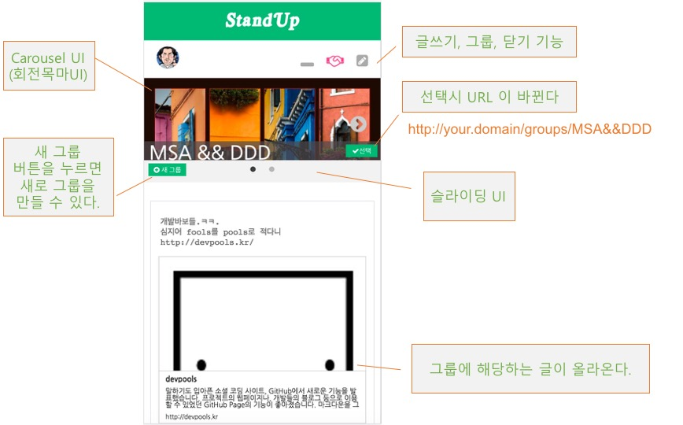
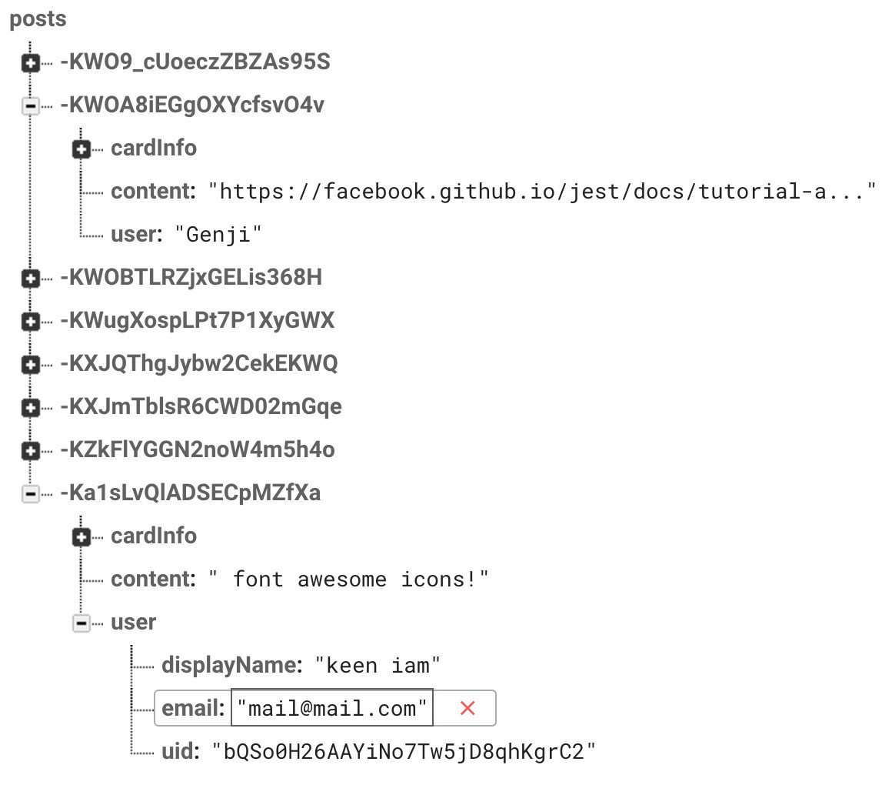
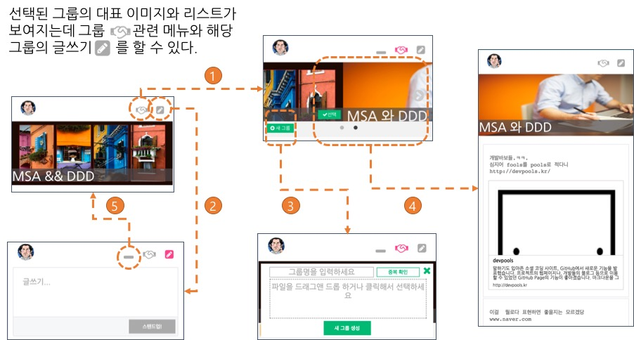
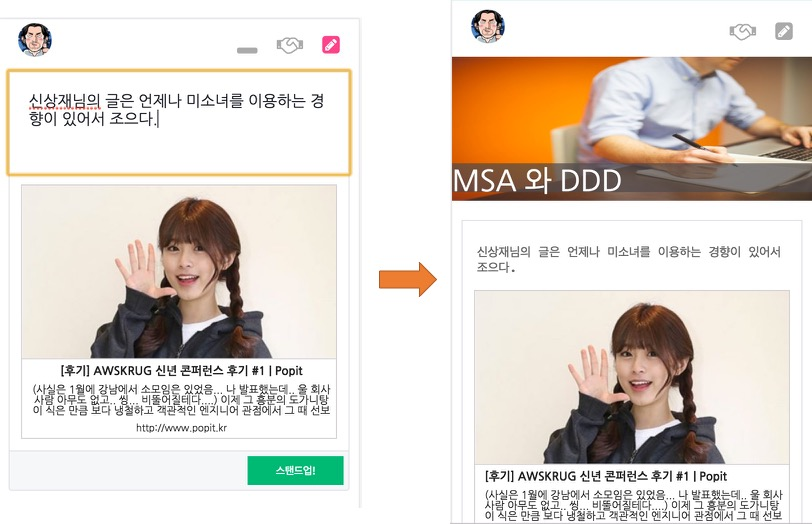
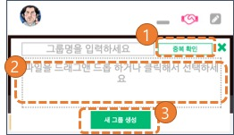

# Day7

## 사용자 스토리5

1. 김개발은 아침 스탠드업 시간에 같이 이야기를 나눌 수 있는 주제를 위해 스탠드업이라는 웹 앱을 찾아간다. 이렇게 함으로써 사람들과 IT에 대한 주제로 커뮤니케이션을 할 수 있다.
2. 김개발이 사이트를 방문해서 자신이 어제 유심하게 읽은 글을 올릴 수 있다. 이렇게 하면 다른 사람들이 볼 수 있다.
 * 에디터 창에 인터넷 링크를 입력하면 자동적으로 페이지 카드가 만들어 진다. 이 때 페이지 링크는 oEmbed를 써서 동작하는데 웹 표준을 준수하고 자연스러워야 한다.
 * 에디터 창은 하나만 있고 거기서 글을 작성하고 업로드 하면 글이 외부 클라우드 공간에 저장이 된다.
3. 김개발이 작성한 글이 목록으로 보여진다. 이렇게 함으로써 다른 사람들이 목록을 확인할 수 있다.
4. 김개발은 google ID를 가지고 로그인을 할 수 있다. 이렇게 함으로써 내가 쓴 글만 따로 모아서 볼 수 있다.
5. 김개발은 그룹 별로 스탠드업을 만들 수 있고 각 그룹별고 글을 올릴 수 있다

그룹 기능을 넣고 나서는 내가 이럴려고 계속한다 했나 자괴감 들어.라는 순간이 몇번이나 왔는지 모르겠습니다. 이유는 몇가지가 있는데 첫번째는 처음 설계를 몇번이나 바꿔야 하는 것이며 , 두 번째는 테스트 코드가 어느 순간 동작하지 않는 것이었습니다. 설계를 바꾸는 것은 개발의 숙명이라 받아들일 수 있었는데 테스트 코드는 어느 순간 놓치고 나니 TDD를 진행하지 못한 부분이 있어 많이 부끄러워 지더군요.

본론으로 들어가서 이번 글에는 유저스토리를 하나 더 추가해 보았습니다. ”김개발은 그룹을 만들 수 있고 각 그룹별고 글을 올릴 수 있다.” 이 내용을 토대로 어떻게 들어갔는지 한번 살펴 보도록 하겠습니다.

## 0. 고칩니다.

이전에 firebase-ui 때문에 외부에 소스를 뺀 적이 있죠? 시간은 어느덧 두달이 지났으니 당연히 npm으로 등록이 되었습니다. 나프다 발표하는 당일에 추가가 되기는 했었습니다.

```
$npm install firebase firebaseui --save
```
## 1. 시작하기 전에


그림 1과 같은 역할을 하는 UI를 먼저 만들어 보려고 합니다. 기본 UI 기능은 그룹을 선택해야 할 수 있어야 하고 그룹을 만들 수 있어야 합니다. 그래서 선택을 할 수 있는 회전목마(Carousel) UI가 필요하고 그룹을 만들 수 있는 UI도 필요해서 새 그룹이라는 버튼을 달아 두었습니다.

## 2. 그룹 만들기
그룹을 만들기 위해서는 당연히 기존의 firebase 에 저장된 스키마에 대한 조정이 필요하겠죠?



기존의 posts라는 스키마에는 모든 글이 저장되고 이 내용을 읽어와서 작업을 했었는데, 이제는 group 별로 조정할 일들이 생겼습니다.


groups는 그룹을 만들면 생성될 수 있는 엔트리가 될 것이고 group-posts에 각 그룹 별로 아티클이 들어갈 수 있도록 작업을 할 것입니다. 먼저 그룹을 생성하고 리스트 하는 작업을 해 보겠습니다. 생성을 하려면 다음과 같은 UI를 통해 그룹간 이동을 할 수 있습니다.



일단 이 일련의 작업들을 하는 세가지 버튼을 만들어 보겠습니다. 먼저 그룹 페이지에 처음 들어오게 되면 그룹에 해당하는 이미지가 보여지고 그룹 작업을 선택하면(1) 새 그룹을 만들 수 있어야 하며(3), 다른 그룹을 선택할 수도(4) 있어야 합니다. 글 쓰기 버튼을 선택하면(2) 글 쓰기를 할 수 있는 에디터가 나와서 글이 작성되어야 하며 여러가지 모든 상황에서 원래 그룹으로 원상복귀(5)할 수 도 있어야 합니다.

어떤 작업을 먼저 하면 좋을까요? React 개발에 있어서는 state를 어떻게 관리할 것인가 를 첫번째 질문으로 가져가야 할 것입니다. 외부에서 URL 기반으로 타이핑해서 들어올 때 처음 형태를 어떻게 가져야 할지를기준으로 설계를 해 보겠습니다.

1. 기존의 edit를 하던 부분을 URL로 처리했던 부분은 그렇게 중요하지 않을 것입니다.
2. 내부에서 “선택" 버튼을 누를 경우는 URL이 변경되어야 합니다.
3. “글쓰기” 를 작성하면 URL은 변경되지 않지만 버튼의 state는 변경되어야 합니다.



먼저 세가지 버튼에 대해서 상태를 유지하고 그 값에 따라 아래 Action Bar를 선택하도록 해 보겠습니다.


```JavaScript
class Buttons extends Component {
  selectButton(args){
    const {dispatch} = this.props;
    dispatch(selectButton(args));
  }
  renderActionBar(selected){
    switch (selected){
      case 'groups':
        return <GroupList/>
      case 'edit' :
        return <Editor/>
      default :
        return null
    }
  }
  render() {
    const {logoUrl,groupName,selectedButton,defaultStyle,groupStyle,editStyle} = this.props;
    return (
      <div>
      <div className="buttons">
        <Profile/>
        <a onClick={()=>this.selectButton('edit')}><i className="fa fa-pencil-square fa-lg" style={editStyle}></i></a>
        <a onClick={()=>this.selectButton('groups')}><i className="fa fa-handshake-o fa-lg" style={groupStyle}></i></a>
        <a onClick={()=>this.selectButton()}><i className="fa fa-window-minimize fa-lg" style={defaultStyle}></i></a>
      </div>
      {this.renderActionBar(selectedButton)}
      {groupName && !selectedButton&&
        <div style={{width:'100%',height:150,position:'relative'}}>
          
          <div className="style_title" style={{width:"100%"}}>{groupName}</div>
        </div>
      }
      </div>
    )
  }
}
let mapStateToProps = (state, ownProps ) => {
  return {...state.default,...ownProps}
}
export default connect(mapStateToProps)(Buttons);
```

버튼을 클릭하면 selectedButton 즉 선택한 버튼을 확인하게 되고 그에 따라서 CSS 값을 변경해 주는 작업을 하는 컴포넌트입니다. 이걸 가능하게 하기 위해서 actions, reducers 폴더 밑에 각각 Button.js파일을 만들었습니다.

```JavaScript
//ActionBar를 그려준다. 안드로이드의 액션바와는 다르다. 액션바와는...
{this.renderActionBar(selectedButton)}
//그룹이 존재하고 버튼선택이 된 경우
{groupName && !selectedButton&&
  <div style={{width:'100%',height:150,position:'relative'}}>
    
    <div className="style_title" style={{width:"100%"}}>{groupName}</div>
  </div>
}
```

renderActionBar는 ActionBar 가 선택된 버튼에 따라서 다르게 그려지도록 했고 어떤 버튼도 선택되지 않을 경우에는 그룹의 로고 URL을 보여주도록합니다.

```JavaScript
import {BUTTON} from '../constants'

const GREY = '#AAA';
const PINK = '#FD478A';
const WHITE = 'white';

export function selectButton( button ){
  return {
    type : BUTTON,
    selectedButton : button,
    defaultStyle: _selectStyle(button).style_d,
    groupStyle: _selectStyle(button).style_g,
    editStyle: _selectStyle(button).style_e
  }
}
function _selectStyle(button){
  switch(button){
    case 'groups':
      return {
        style_d: {color: GREY},
        style_g: {color: PINK},
        style_e: {color: GREY}
      }
    case 'edit' :
      return {
        style_d: {color: GREY},
        style_g: {color: GREY},
        style_e: {color: PINK}
      }
    default:
      return {
        style_d: {color: WHITE},
        style_g: {color: GREY},
        style_e: {color: GREY}
      }
  }
};

export default function getButtons(state,action){
  return {...state,...action};
}
```


### 2.1. 그룹 만들기
자, 그럼 그룹은 어떻게 만들까요?



그룹명이 존재하는지 (1)중복 확인을 한 후에 (2)드래그앤 드롭을 통한 파일 업로드, (3)그룹생성 의 순서대로 이루어집니다.

이중 1,3번의 Group의 Real Time DB에 대한 DAO는 여기서 다루지 않겠습니다. (소스에서 확인하세요.) 드래그앤 드롭해서 파일 업로드 하는 부분만 확인을 하면 Firebase의 FileUpload에 대한 인터페이스와 Dropzone UI 에 대한 이야기로 나눠서 볼 수 있을 거 같습니다.

#### Firebase FileUpload

src 폴더 아래 FileUtil.js를 만들었습니다.

```JavaScript
import firebase from 'firebase'

export default function fileupload(files,size, callback){
  if(size && files.length!==size){
    if(size===1)alert("file은 하나만 업로드 가능합니다");
    else alert("지정된 파일 갯수랑 같지 않습니다.")
    return;
  }
  var storageRef = firebase.storage().ref();
  files.forEach(function(file){
    //확장자
    let ext = file.name.split('.').pop();
    let metadata = {};
    if( ext === 'jpg' ) metadata.contentType = 'image/jpeg';
    if( ext === 'png' ) metadata.contentType = 'image/png';
    if( ext === 'gif' ) metadata.contentType = 'image/gif';

    // 이미지와 메타데이타를
    var uploadTask = storageRef.child('images/' + file.name).put(file, metadata);

    // 상태변화를 감지하고 에러가 나거나 완료가 되면 콜백함수를 호출한다
    uploadTask.on(firebase.storage.TaskEvent.STATE_CHANGED, // '상태변화'감지
      function(snapshot) {
        // 프로그레스 계산. 전체 보내는 양을
        var progress = (snapshot.bytesTransferred / snapshot.totalBytes) * 100;
        console.log('Upload is ' + progress + '% done');
        switch (snapshot.state) {
          case firebase.storage.TaskState.PAUSED: // '정지'
            console.log('Upload is paused');
            break;
          case firebase.storage.TaskState.RUNNING: // '업로드 중'
            console.log('Upload is running');
            break;
          default :
            //
        }
      }, function(error) {
        switch (error.code) {
          case 'storage/unauthorized':
            console.log("unauthorized user");
            break;
          case 'storage/canceled':
            console.log("user cancel!");
            break;
          case 'storage/unknown':
            console.log("unexpected error")
            break;
          default:
            //do nothing
        }
      }, function() {
        // 다운로드 URL 전송.
      }, function()
        callback(uploadTask.snapshot.downloadURL);
      });
  })

}

```

주목 하셔야 할 부분은 다음의 storageRef 입니다.

```JavaScript
//storageRef 정의
var storageRef = firebase.storage().ref();
// 업로드
var uploadTask = storageRef.child('images/' + file.name).put(file, metadata);
// 이벤트 정의
uploadTask.on(firebase.storage.TaskEvent.STATE_CHANGED,... (중략)
```

그럼 이 부분을 호출한 부분을 살펴 볼까요?

### Dropzone

src 파일 밑에 GroupAdd.js 라는 파일을 만들었습니다. 이 파일에서 중요하게 눈여겨 보실 부분은 react-dropzone이라는 라이브러리를 이용했다는 점이고 그 부분은 소스의 처음 import 부분에 포함이 되어 있습니다.

```JavaScript
<Dropzone onDrop={(acceptedFiles, rejectedFiles)=>this.onDrop} accept="image/*" className="drop-file padding-top">
  <div>파일을 드래그앤 드롭 하거나 클릭해서 선택하세요</div>
</Dropzone>
```

Dropzone 에서 onDrop이라는 이벤트를 만들었고 이 이벤트는 기본적으로 허용된 파일과 거절된 파일을 인자로 받아서 처리해 줍니다.

```JavaScript
onDrop (acceptedFiles, rejectedFiles) {
...
  if(acceptedFiles && acceptedFiles.length>0){
    ...
    imageUpload(acceptedFiles, 1, (downloadUrl)=>{
      this.setState({
        groupImage:downloadUrl,
        isSpin: false
      });
    });
  }else{
...
  }
}
```

## 3. 조회하기

이렇게 그룹을 만들고 났으면 URL 별로 그룹이 조회가 되도록 내용을 추가해 줍니다. 스키마에 대해서는 서두에 밝혔으니 소스코드 레벨로만 간단하게 설명하겠습니다. (FirebaseDAO에 대해서는 이미 수차례 설명했으니 소스코드도 최대한 짧게 가겠습니다.)

reducer는 생략하고 action만 살펴보고 넘어가겠습니다.

```JavaScript
export function groupSelect(groupName){
  return (dispatch) => {
    dao.getGroup(groupName).once('value', (snapshot) => {
      if(snapshot.val()) {
        let logoUrl = snapshot.val().logoUrl;
        dispatch(getGroup(groupName, logoUrl));
        dispatch(selectButton());
      }
    })
  }
}
export function getGroup(groupName, logoUrl){
  return (dispatch) => {
    dao.listGroupArticle(groupName).then((articles)=>dispatch(getArticle(articles,groupName,logoUrl)));
  }
}
```

소스코드 처럼 group을 가지고 와서 로고 및 데이타를 가져온 뒤에 버튼을 선택하는 액션을 다시한번 연결하고는 끝이 납니다. 라우터 소스는 그에 따라 아래와 같이 간단해 졌습니다.

```JavaScript
<Provider store={store}>
  <Router history={history}>
    <Route path="/" component={App}>
      <Route path="login" component={Login}/>
      <Route path="groups/:groupName" />
      <Route path="*" component={NotFound}/>
    </Route>
  </Router>
</Provider>
```
이렇게 그룹의 개념을 집어 넣어서 전체 내용을 다시한번 리마인드 하면서 전체에 대한 시리즈는 끝을 낼까 합니다.

지금까지는 실행에 대한 내용이었고 이후는 서버리스 아키텍처에 대한 고찰에 관한 이야기 + 리팩토링에 대한 이야기를 해 볼까 합니다.

그 동안 어려운 내용 같이 따라오신다고 고생하셨습니다.

소스코드는 아래 링크를 참고하시면 됩니다.

https://github.com/ehrudxo/standup/tree/day7
