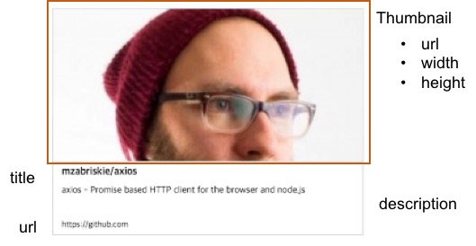
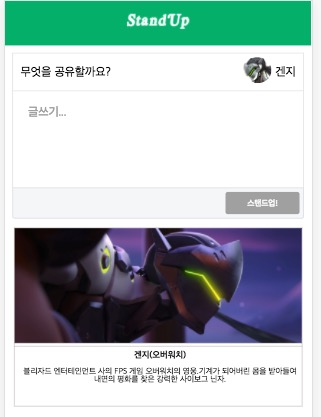
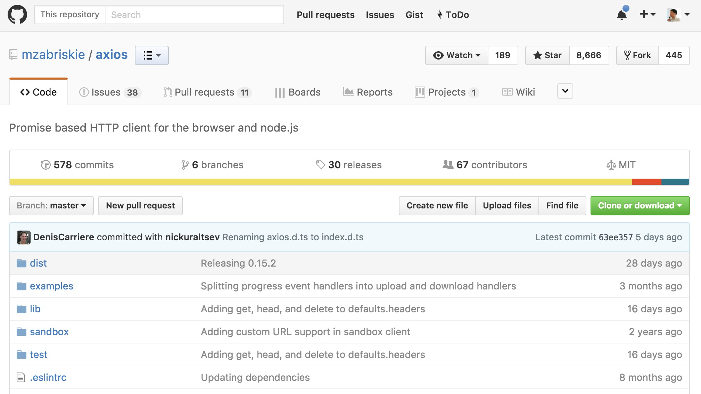
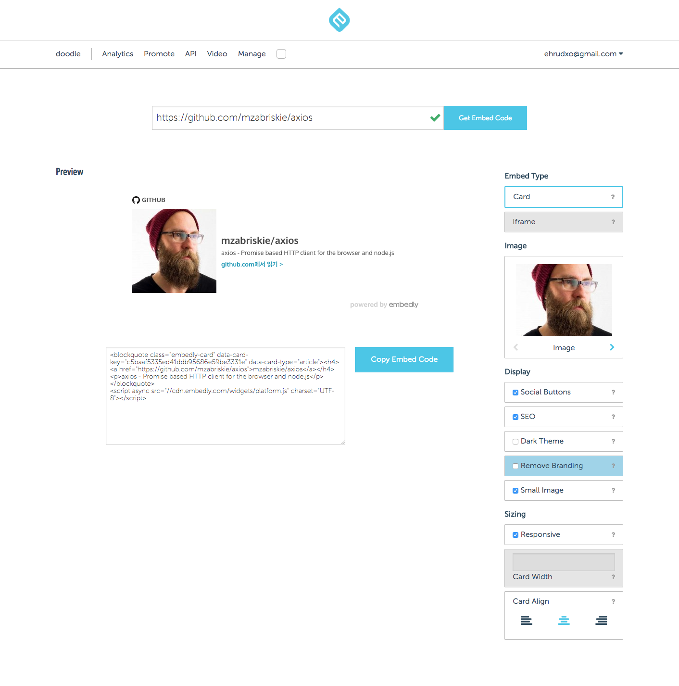
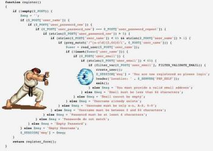

# Day5

## 사용자 스토리3

```
3. 김개발이 작성한 글이 목록으로 보여진다. 이렇게 함으로써 다른 사람들이 목록을 확인할 수 있다.
```

계속 하겠습니다.
이번에는 글 목록과 편집기를 풍성하게 해 줄 Card를 작성하도록 하겠습니다.
시작하기 전에
```bash
$git checkout day4
```
를 통해 day4 branch 부터 시작하는 것을 잊으면 안되겠지요.

## Card 만들기

사이트 링크가 편집기에 작성이 되면 어떻게 보여질 것인지에 대한 정의가 이번에는 내려져야 할 것입니다.



[그림1]

그림1에서 보여지는 것과 같이 썸네일 이미지는 그 이미지의 url과 width와 height가 있어야 제대로 화면에 보여질 수 있을 것이고, 제목(title)과 설명(description) 그리고 사이트의 링크가 포함되어져 있어야 할 것입니다.

이렇게 카드를 만들고 나면 이 카드는 목록 작업에도 똑같이 이루어질 수 있을 것입니다.

그러면 일단, Article로 만들어 놓은 Mock 데이타를 바탕으로 진행을 해 보도록 하겠습니다.

먼저 카드를 한번 만들어 볼까요?

src 폴더 아래 Card.js라는 파일을 만들고 아래와 같이 작성해 줍니다.

```JavaScript
import React, { Component } from 'react'
import './Card.css'

export default class Card extends Component {
  render(){
    let cardInfo = this.props.cardInfo;
    if(cardInfo){
      return(
        <a className="card" href={cardInfo.url} target="_blank">
          <div className="card_image" >
            
          </div>
          <div className="borderTop">
          <div className="card_text">
            <p className="card_title">{cardInfo.title}</p>
            <p className="card_desc">{cardInfo.description}</p>
            <p className="card_provider">{cardInfo.provider_url}</p>
          </div>
          </div>
        </a>
      )
    }else{
      return null;
    }
  }
}
```
똑같이  Card.css를 다음과 같이 만들어 줍니다.
```CSS
.card{
  color: #222;
  text-decoration: none;
  position: relative;
  border: 1px solid rgba(79, 73, 75, 0.28);
  display: block;
  overflow: hidden;
  margin: 12px 12px 12px 12px;
  min-height: 83px;
  font-size: 10px;
}
.card_image{
  overflow: hidden;
  left: 0;
  top: 0;
  max-height: 180px;
}
.width100{
  width: 100%;
  height:auto;
  background-size: 100% 100%;
}
.card_img{
  height: 100%;
  transform: translateX(-50%);
  position: relative;
  left: 50%;
  border-bottom: 1px solid rgba(79, 73, 75, 0.28);
}
.card_text{
  margin-left: 5px;
  min-height: 80px;
  padding: 5px;
  box-sizing: border-box
}
.card_title{
  margin: 0;
  font-size: 12px;
  font-weight: bold;
  display: inline-block;
  white-space: nowrap;
  overflow: hidden;
  text-overflow: ellipsis;
}
.card_desc{
  margin: 5px 0 0;
  font-size: 11px;
  display: inline-block;
  overflow: hidden;
  text-overflow: ellipsis;
  /* 여러 줄 자르기 추가 스타일 */
  white-space: normal;
  line-height: 1;
  height: 3em;
}
.card_provider {
  margin: 5px 0 0;
  font-size: 10px
}
.borderTop{
  border-top: 1px solid rgba(79, 73, 75, 0.28);
}

```
이렇게 까지 적용하고 나면 카드를 위한 적용사항은 모두 진행 되었다고 볼 수 있습니다.
한번 Mock 데이타를 가지고 확인해 볼까요? Test 를 눈으로 해 보기 위해서 이번에는 App.js를 변경해 보겠습니다.

그 전에 Article 은 다음과 같이 변경해서 불확실성을 좀 줄이도록 하겠습니다. urls를 배열로 받은 부분은
cardInfo라는 단일 객체로 변경하겠습니다.
```JavaScript
export default function getArticle(
  user = "Genji",
  content = "겐지가 함께한다.",
  url = "https://namu.wiki/w/%EA%B2%90%EC%A7%80(%EC%98%A4%EB%B2%84%EC%9B%8C%EC%B9%98)",
  title="겐지(오버워치)",
  description = "블리자드 엔터테인먼트 사의 FPS 게임 오버워치의 영웅.기계가 되어버린 몸을 받아들여 내면의 평화를 찾은 강력한 사이보그 닌자.",
  thumbnail_url = "https://image-proxy.namuwikiusercontent.com/r/http%3A%2F%2Fi66.tinypic.com%2F10mpje9.jpg" ,
  thumbnail_width = 80,
  thumbnail_height =80,
  provider_name = "namu wiki"
){
  return {
    user : user,
    content : content,
    cardInfo:{
      url : url,
      title:title,
      description : description,
      thumbnail_url : thumbnail_url,
      thumbnail_width : thumbnail_width,
      thumbnail_height :thumbnail_height,
      provider_name : provider_name
    }
  }
}
```
이후 App.js파일은 다음과 같이 변경합니다.
```JavaScript
import Card from './Card'
import getArticle from './Article'

class App extends Component {
  constructor(){
    //...중략..
    this.cardInfo = getArticle().cardInfo;
  }
  //...중략..
  render() {
    //...중략...
      <Card cardInfo = {this.cardInfo}/>
  }
}
```
이렇게 확인해 보면 다음과 같은 화면을 확인할 수 있습니다.



하지만 일단 Card를 확인했으면 App.js 파일은 되돌리고, Article.js파일은 __tests__ 파일 폴더 아래
로 내립니다.

이럴때 사용하기 좋은 툴이 git 인데 App.js 파일 이외의 파일들은 커밋하고 reset 해 버리면 원래 파일로
원상복귀 됩니다.

```bash
$standup>mv Article.js ./__tests__/Article.js
$standup>git add Card.js Card.css ./__tests__/Article.js
$standup>git commit -m "Card added and Article moved"
$standup>git reset --hard
```

이렇게 Article.js파일을 테스트 파일로 빼 버리는 거는 Mock으로써 이제 그 역할을 다 했기 때문이고, 실제
돌아가는 수행에 필요한 역할을 다 했기 때문입니다. 이제 이 Card에 들어갈 데이타를 얻어올 방법을 찾아볼까요?

### Embed.ly

Embed.ly 서비스는 oEmbed open format을 토대로 만들어진 contents 삽입(embed) 서비스 입니다.
예를들어 youtube 같은 provier의 경우

```
http://www.youtube.com/oembed?url=http%3A//youtube.com/watch%3Fv%3DM3r2XDceM6A&format=json
```
의 형태로 질의를 보내면
```json
{
	"version": "1.0",
	"type": "video",
	"provider_name": "YouTube",
	"provider_url": "http://youtube.com/",
	"width": 425,
	"height": 344,
	"title": "Amazing Nintendo Facts",
	"author_name": "ZackScott",
	"author_url": "http://www.youtube.com/user/ZackScott",
	"html":
		"<object width=\"425\" height=\"344\">
			<param name=\"movie\" value=\"http://www.youtube.com/v/M3r2XDceM6A&fs=1\"></param>
			<param name=\"allowFullScreen\" value=\"true\"></param>
			<param name=\"allowscriptaccess\" value=\"always\"></param>
			<embed src=\"http://www.youtube.com/v/M3r2XDceM6A&fs=1\"
				type=\"application/x-shockwave-flash\" width=\"425\" height=\"344\"
				allowscriptaccess=\"always\" allowfullscreen=\"true\"></embed>
		</object>",
}
```
의 형태로 답변을 주게 되어 있습니다.

이렇게 oEmbed API 포맷을 통해 다른 사이트의 컨텐츠를 쉽게 블로그나 게시판에 삽입(embed)할 수 있는 것
이죠.

하지만, 우리가 하려고 하는 것은 각각의 사이트에서 사이트의 타이틀과 description, 이미지들을 뽑아 내는
일들을 해야합니다. 보통 오픈 소스들을 찾아서 개발을 하려고 보면 Facebook에서 사용중인 og meta 태그들
을 많이 사용하고 있습니다. 페이스 북이 카드로 인식하게 하려면 og 태그를 써야하는 셈이 된 것인거죠.
게다가 og 태그를 아직 쓰지 않은 작은 사이트들은 이런 부분에 대한 지원이 없어서 카드에 이미지는 안나오는
경우를 종종 보곤 합니다.

이런 여타 사이트들을 돌아 다니면서 해 줘야 하는 작업들. 예를 들어 og 태그가 없을 때 어떻게 처리할 지,
이미지가 없을때 어떻게 처리할지 등등, 그리고 결론적으로 내가 원하는 JSON 으로 받고 싶은 데이타 처리 작업
등의 일들을 oEmbed 포맷 API로 제공을 해 주는 사이트가 이 Embed.ly 입니다.

우리는 여기에서 우리가 Card를 만들 때 드는 정보를 얻어낼 것입니다.


[그림 3]

이 API를 얻는 다는 것은 API key를 우선 얻는다는 것이겠죠?

회원가입이 꽤나 재밌는데 일단 개발자인지를 확인하는 문제를 제출합니다. 너무 쉬워서 하품이 날 지경이니 긴장
은 안하셔도 됩니다.

가입을 하고 나면 처음은 프로젝트를 만들게 됩니다. standup 으로 만들어 보겠습니다.


[그림4]

그리고 팀 멤버를 초대하는 화면은 skip하셔도 됩니다. 이후 email 확인을 하고 나면 서비스를 이용할 수 있는데
Manage API key를 통해 발급받을 수 있습니다.


회원 가입을 하고 로그인 하면 다음과 같이 카드나 iframe 소스를 얻는 실습을 해볼 수도 있습니다.



하지만 우리에게 필요한 것은 API로 JSON을 얻는 것이겠죠?

얻은 API key는 .env 파일에 저장하고 config.js파일을 통해 가져 오는데
```JavaScript
var firebase_config = {
 apiKey: process.env.REACT_APP_FIREBASE_KEY,
 authDomain: process.env.REACT_APP_AUTH_DOMAIN,
 databaseURL: process.env.REACT_APP_DB_URL,
 storageBucket: process.env.REACT_APP_STRG_BKT,
 messagingSenderId: process.env.REACT_APP_MSG_SENDER_ID
}
export var embedlyKey = process.env.REACT_APP_EMBEDLY_KEY;
export default firebase_config;
```
와 같이 저장하면 됩니다.

API가 잘 작동하는지 확인해 보기 위해 call을 직접해 보도록 하겠습니다.
```
https://api.embedly.com/1/oembed?url=https:%2F%2Fgithub.com%2Fmzabriskie%2Faxios&key=
```
key 부분만 여러분이 얻은 키로 채워 주시면 다음과 같은 결과를 얻어올 수 있습니다.

```json
{  
   "provider_url":"https://github.com",
   "description":"axios - Promise based HTTP client for the browser and node.js",
   "title":"mzabriskie/axios",
   "thumbnail_width":400,
   "url":"https://github.com/mzabriskie/axios",
   "thumbnail_url":"https://avatars2.githubusercontent.com/u/199035?v=3&s=400",
   "version":"1.0",
   "provider_name":"GitHub",
   "type":"link",
   "thumbnail_height":400
}
```

이제 URL을 호출해 직접 API를 통해 카드를 만들어 보도록 하겠습니다.

### axios.js
request 를 만들 클라이언트 모듈로 무엇을 쓸까하는 고민은 많은 개발자들이 늘 겪는 고민일 거라고 생각합
니다. 안드로이드의 경우는 retrofit 을 많이 쓰는 거 같은데 프론트엔드에서 많이 쓰는 거는 어떤게 있을까
요? 가장 유명하고 잘 알려져 있는 예로는 jquery가 있습니다. $.get으로 대표되는 놀라운 간편성 및 DOM
과 직접 연계 및 다양한 옵션이라는 강력한 무기를 가지고 있죠.

하지만, React 및 Node.js 환경에서는 이걸 쓰기에는 조금 꺼려집니다. 첫번째는 강점인 DOM 과의 궁합인
데요. 이것이 왜 약점이 되는가 하면 React는 Virtual DOM을 이용해 웹 컴포넌트를 사용한다는 점에서 콜
백 처리 및 DOM 의 중복 처리 여부의 단점이 있고 Node환경에서는 굳이 사용하지 않아도 될 DOM컴포넌트의
의존성 때문에 JSDOM이라는 무거운 모듈을 같이 로딩해야 한다는 어려움이 있습니다.

그래서 superagent 를 포함한 가벼운 request용 프레임워크들이 최신 대세가 되었는데요. 제가 이번에 얘기
하고 싶은 모듈은 axios.js입니다.

https://github.com/mzabriskie/axios


이 axios.js 의 강점은 뭐니뭐니 해도 Promise 기반의 HTTP 클라이언트라는데에 있습니다.

기존의 모듈들은 주로 jquery가 해 주던 내용에서 HTTP 클라이언트 부분만 유사하게 (혹은 호환되게) 코드를
작성했지만 이 axios가 리턴해 주는 형태는 ES2015의 Promise 객체이기 때문에 현재의 자바 스크립트가 가
야할 길에서 가장 맞는 선택지라고 보여지고 게다가 Jest 테스트의 경우는 리턴값을 undefined 와 Promise
로만 받기 때문에 테스트 코드를 짤 때에도 적합합니다.

그래서 아래와 같은 코드가 가능해 집니다.

```JavaScript
axios.get('/user?ID=12345')
  .then(function (response) {
    console.log(response);
  })
  .catch(function (error) {
    console.log(error);
  });

// Optionally the request above could also be done as
axios.get('/user', {
    params: {
      ID: 12345
    }
  })
  .then(function (response) {
    console.log(response);
  })
  .catch(function (error) {
    console.log(error);
  });
```

#### 여기서 잠깐. Promise란?
> Promise 패턴은 JavaScript에서 콜백을 다루는 패턴 중에 하나입니다.
> 보통 콜백을 매개 변수로 다뤄서 함수의 매개변수로 보내는 코드
  ```JavaScript
  function callback(){
    console.log("this is callback function");
  }
  function http(){
    request.get("http://www.devpools.kr",callback)
  }
  ```
> 의 형태를 띄거나 이걸 익명함수로 바꾸면
  ```JavaScript
  function http(){
    request.get("http://www.devpools.kr",()=>{
    console.log("this is callback function");
  })
  }
  ```
> 의 모습을 띄게 됩니다.
> 하지만 이런 콜백을 여러번 호출하게 되면
> 이른바 콜백 지옥에 떨어지게 됩니다. 가독성도 무척이나 떨어지게 되는 셈입니다.

>
> 이런 일들에서 구원코자 여러 방법들이 동원 되었지만 ES2015에서 정립된 표준은 Promises 입니다.
> Promise는 위의 함수가 아래와 같이 변화하는 것입니다.
```JavaScript
  function http(){
    request.get("http://www.devpools.kr")
            .then(()=>{console.log("this is Promise!")})
            .catch((error)=>{console.log(error)})
  }
```
> 성공을 했을 때 then으로 빠지고, 실패를 하면 catch에 들어가는 패턴.
> 어디선가 보지 않았나요? 내 우리는 이미 Firebase DAO를 작성할 때에 이 패턴을 확인했습니다.


.
