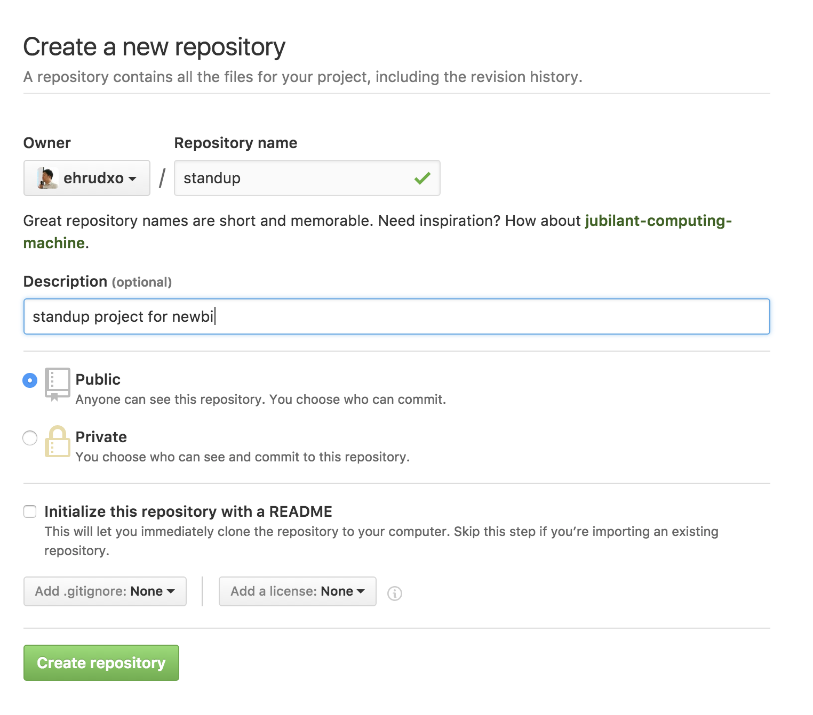
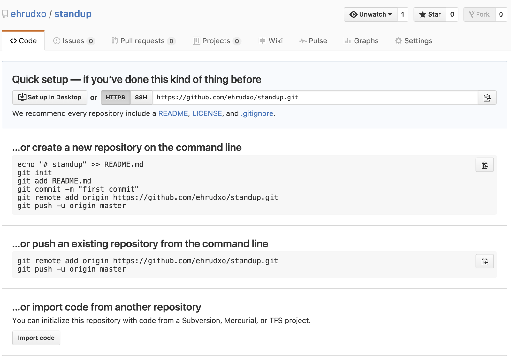

# 스탠드업!

## 개요

제가 일하고 있는 팀은 애자일 개발을 하고 있습니다. 이제는 너무나도 많은 회사, 그 안에서도 많은 팀에서 애자일 개발 방법론을 가지고 개발을 하고 있습니다.

여러가지 애자일 개발 방법론 중에서도 단연코 가장 많이 사용되는 방법론은 스크럼 혹은 스탠드업입니다. 스크럼이라고 하면 굉장히 넓은 의미의 이터레이션까지 포함하시는 경우가 있으니 스탠드 업에만 국한해서 얘기를 하겠습니다.

```
The stand-up has particular value in Agile software development processes, such as Scrum or Kanban, but can be utilized in context of any software-development methodology.
```

출처 : [stand-up meeting](https://en.wikipedia.org/wiki/Stand-up_meeting)

꼭 애자일이 아니더라도 소프트웨어 개발을 위해서는 종종 사용되는 방법이라고 하고 타임박싱은 5분에서 15분 정도를 합니다.

나머지는 조금씩 다를 수 있겠지만, 10여명이 넘는 팀 전체 스탠드업에는 각 나눠진 작은 팀의 주제보다는 팀 전체를 위한 이슈를 이야기 하는데요. 머리를 말랑말랑하기 위해 간단한 IT 이야기를 할 수 있는 앱을 만들어 볼까 합니다.

기왕이면 아침에 스마트폰으로 볼 수 있도록 모바일을 먼저 고려하는 것도 당연히 들어가야 합니다.

## 설계

### 페르소나
이름 : 김개발
애자일 개발자 김개발 씨는 IT 트렌드에 무척이나 민감하다. 아침 스탠드 업 시간에 일간 보고만 하는 것이 매우 못마땅한데 기술적인 이야기를 같이 하면 좋겠다.

### User Story

1. 김개발은 아침 스탠드업 시간에 같이 이야기를 나눌 수 있는 주제를 위해 스탠드업이라는 웹 앱을 찾아간다. 이렇게 함으로써 사람들과 IT에 대한 주제로 커뮤니케이션을 할 수 있다.

2. 김개발이 사이트를 방문해서 자신이 어제 유심하게 읽은 글을 올릴 수 있다. 이렇게 하면 다른 사람들이 볼 수 있다.
  * 에디터 창에 인터넷 링크를 입력하면 자동적으로 페이지 카드가 만들어 진다. 이 때 페이지 링크는 oEmbed를 써서 동작하는데 웹 표준을 준수하고 자연스러워야 한다.
  * 에디터 창은 하나만 있고 거기서 글을 작성하고 업로드 하면 글이 외부 클라우드 공간에 저장이 된다.  

3. 김개발이 작성한 글이 목록으로 보여진다. 이렇게 함으로써 다른 사람들이 목록을 확인할 수 있다.


### 개발 레파지토리 셋팅



위와 같이 프로젝트를 만들어 줍니다. 물론 fork를 따는 방법도 있겠지만(그래주시면 일단은 감사! star도 한번 눌러주시면 더 감사!) 따라가는 입장에서는 만들어 보는 방법도 좋은 시도 입니다.
만들고 나면 아래와 같이 설정창이 뜨게 됩니다.



### Readme 작성

Readme 파일을 아래와 같이 작성하고 프로젝트를 만들고 Day1은 종료하도록 하겠습니다.

```md
# StandUP!

애자일 프랙티스 standup 할 때 아이스브레이킹에 사용되는 IT기술에 관련된 주제를 나눌 수 있는 아티클들을 공유하는 소셜미디어 프로젝트

## UserStory

1. 김개발은 아침 스탠드업 시간에 같이 이야기를 나눌 수 있는 주제를 위해 스탠드업이라는 웹 앱을 찾아간다. 이렇게 함으로써 사람들과 IT에 대한 주제로 커뮤니케이션을 할 수 있다.
2. 김개발이 사이트를 방문해서 자신이 어제 유심하게 읽은 글을 올릴 수 있다. 이렇게 하면 다른 사람들이 볼 수 있다.
 * 에디터 창은 하나만 있고 거기서 글을 작성하고 업로드 하면 글이 외부 클라우드 공간에 저장이 된다.
3. 김개발이 작성한 글이 목록으로 보여진다. 이렇게 함으로써 다른 사람들이 목록을 확인할 수 있다.
 * 목록글은 해당IT 주제의 대표 이미지와 제목, 간단 요약등이 들어 있는 카드의 리스트 형태로 나열이 되어야 한다.

## 사용법

아직 빌드중이지만 아래와 같이 설계됨

### 설치

$npm install

### 실행

$npm start

이렇게 실행하고 http://localhost:3000 으로 접속하시면 개발 버전을 확인할 수 있습니다.

## API
API는 계획없는 자체 프로젝트 입니다. 추후 발생할 여지는 있음.

## production

제품을 빌드하려면

npm run build


제품을 디플로이 하려면

npm run deploy

를 통해 작업할 수 있습니다.

### 라이센스

MIT
```
