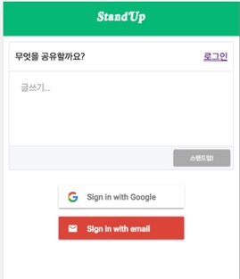
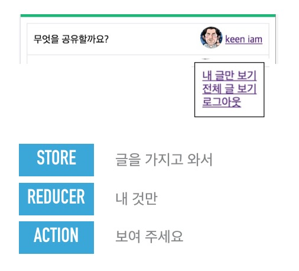

# Day6

## 사용자 스토리4

```
1. 김개발은 아침 스탠드업 시간에 같이 이야기를 나눌 수 있는 주제를 위해 스탠드업이라는 웹 앱을 찾아간다. 이렇게 함으로써 사람들과 IT에 대한 주제로 커뮤니케이션을 할 수 있다.

2. 김개발이 사이트를 방문해서 자신이 어제 유심하게 읽은 글을 올릴 수 있다. 이렇게 하면 다른 사람들이 볼 수 있다.
  * 에디터 창에 인터넷 링크를 입력하면 자동적으로 페이지 카드가 만들어 진다. 이 때 페이지 링크는 oEmbed를 써서 동작하는데 웹 표준을 준수하고 자연스러워야 한다.
  * 에디터 창은 하나만 있고 거기서 글을 작성하고 업로드 하면 글이 외부 클라우드 공간에 저장이 된다.  

3. 김개발이 작성한 글이 목록으로 보여진다. 이렇게 함으로써 다른 사람들이 목록을 확인할 수 있다.
4. 김개발은 google ID를 가지고 로그인을 할 수 있다. 이렇게 함으로써 내가 쓴 글만 따로 모아서 볼 수 있다.
```

벌써 6일차까지 왔습니다. 조금만 더 힘내면 됩니다. 이제 사용자 스토리의 대부분은 완료한 것 같은데 하나를
더 추가해 보도록 하겠습니다.

```
김개발은 google ID를 가지고 로그인을 할 수 있다. 이렇게 함으로써 내가 쓴 글만 따로 모아서 볼 수 있다.
```

"로그인을 하는데 구글 ID로 해야한다" 라는 미션이 우리에게 주어졌습니다. 일단 사용자 스토리의 뒷쪽은 무시
하고 로그인에 집중해 보도록 하겠습니다.


[그림1]

그림 1과 같이 로그인을 하고 나면 프로필 페이지가 바뀌는 역할을 만들어 보도록 하겠습니다.

그러기 위해서는 일단 중요한 결정이 필요합니다. 저 중간에 보이는 로그인 페이지를 어떻게 구성할 것인가.

이 "어떻게"에는 이른바 페이지 구성에 대한 논의가 필요한데, 최근에는 SPA(Single Page Application)
을 쓰게 됩니다. 모바일 환경에서는 페이지 이동중의 리소스파일(JS,CSS,이미지 파일들)의 로딩을 줄이는 기술
들이 많이 선호되는데 Ajax를 이용한 SPA구성이 점점 필수가 되어가고 있습니다.

그러면 React 에서 이 SPA를 하기 위해서는 여러가지 방법이 있겠지만 이렇게 장기적으로는 페이지가 늘어날 것
을 생각하면 React-Router 를 가장 먼저 생각해 볼 수 있습니다.

## React-Router

기존의 페이지를 설계하는 혹은 분기(routing)하는 방법은 주로 서버단에서 이루어졌습니다. Node.js 에서
많이 사용하는 Exrpess.js를 생각해 보더라도 url에 매핑되는 request와 그에 대응하는 response를
컨트롤러에서 만들어 주었다고 하면 지금 얘기하는 React-Router의 경우는 클라이언트 단에서 이런 일련의
일들이 이뤄지게 됩니다.

그것도 그럴께 URL에 따라 페이지가 바뀌는데 페이지가 바뀌는 것이 SPA 환경에서는 JavaScript 로직안에
다 들어가 있습니다.

```
$npm install react-router --save
```
작업을 통해 설치가 가능합니다.

깃헙페이지 주소는 다음과 같습니다.

https://github.com/ReactTraining/react-router

관련된 내용은 잘 숙지하시면 도움이 될텐데 저희가 만들고 있는 쪽에서는 다음과 같이 이용해 보도록 하겠습니다.

먼저 src 폴더 아래의 index.js파일을 열어보겠습니다. 사실은 여기가 진입점이지만 그동안은 App.js 파일이
컴포넌트들의 진입점인 듯 코드를 짜왔습니다. 모두 이때를 위한 복선이었다는 사실!

아래와 같은 형태로 한번 코드를 작성해 보도록 하겠습니다.
```JavaScript
import { Router, Route, IndexRoute } from 'react-router'

ReactDOM.render(
  <Provider>
    <Router>
      <Route path="/" component={App}>
        <IndexRoute component={CardList}/>
        <Route path="/login" component={Login}/>
        <Route path="*" component={NotFound}/>
      </Route>
    </Router>
  </Provider>,
  document.getElementById('root')
);
```

뭔가가 많이 달라진 느낌이 드시나요?

그동안 App.js 파일 안에 있던 CardList가 밖으로 뺴져 나와 있고 분기중의 한 옵션으로 빠져 있다는 사실
을 보게 됩니다. 이러면 이쯤에서 어떻게 articles 값을 속성으로 넘기지? state 에 대한 관리는 어떻게 하
지 하는 의구심을 가지고 바라보시는 분도 있을 듯 합니다.

관련해서 어떻게 해결할 지는 조금 더 뒤에서 살펴 보기로 하고

```
http://<your-domain-url>/
```
링크를 따라가면 CardList 컴포넌트가 호출이 되겠구나
```
http://<your-domain-url>/Login
```
링크를 따라가면 Login 컴포넌트가 호출이 되겠구나 하는 생각을 하실 수 있다고 알 수 있을 거 같습니다.

먼저 NotFound는 이 외의 URL을 외부 사용자가 임의로 치고 들어올 때를 대비해서 만들어 두었으니 다음과 같이
만들어 둡니다.

```JavaScript
export default class NotFound extends Component {
  reder(){
    return(
      <div>Not Found!</div>
    )
  }
}
```

그러고 나서 Login 페이지를 만들어 봐야죠.

## Firebase UI Auth

로그인 페이지를 어떻게 만들고 데이터를 어떻게 입력하고 인증은 어떻게 할지 생각하셨던 분이 많으셨을 거라고
생각이 듭니다.

하지만 걱정은 안하셔도 될 거 같습니다. Firebase 는 fire base web 모듈을 제공해 줍니다.
개발자를 무척이나 편하게 해 주는 거죠. src 폴더아래 Login.js 를 다음과 같이 작성만 하면 됩니다
```JavaScript
/*global firebaseui,firebase*/
import React,{Component} from 'react'
import FirebaseDao from './FirebaseDao'
import config from './config'
import { connect } from 'react-redux'

class Login extends Component {
  constructor(props){
    super(props);
    this.ui = (new FirebaseDao(config)).getUI();
  }
  componentDidMount() {
    var uiConfig = {
      'signInSuccessUrl' : window.location.origin,
      'signInOptions': [
        firebase.auth.GoogleAuthProvider.PROVIDER_ID
      ]
    };
    this.ui.start('#firebaseui-auth', uiConfig);
  }
  componentWillUnmount() {
    this.ui.reset();
  }
  render() {
    return (
      <div id="firebaseui-auth"></div>
    );
  }
};
function mapStateToProps(state, ownProps) {
  return {
    id: ownProps.params.id,
    filter: ownProps.location.query.filter
  };
}
export default connect(mapStateToProps)(Login);
```
이렇게 하고 나면 될 거라고 했는데 뭔가 의구심이 드는 사람이 있을 겁니다.
모듈 인스톨도 안하고 지나갈 수 있냐! 라는 것입니다.
아마도 주의 깊게 보신 분들이 있으실 거 같은데 페이지 제일 위에

```
/*global firebaseui,firebase*/
```

이라고 적어둔 부분이 있습니다. 네, firebaseui 의 경우는 아직 npm 모듈을 지원하지 않아서 이렇게 전역
변수로 지정을 해두고 public 폴더 아래에서 바로 firebase, firebaseui를 가져오도록 바꿔줘야 합니다.

```html
<script src="https://www.gstatic.com/firebasejs/3.6.1/firebase.js"></script>
<script src="https://www.gstatic.com/firebasejs/ui/live/1.0/firebase-ui-auth.js"></script>
<link type="text/css" rel="stylesheet" href="https://www.gstatic.com/firebasejs/ui/live/1.0/firebase-ui-auth.css" />
```

그렇게 하고 나면 그림 2와 같은 로그인 화면을 볼 수 있습니다.


[그림2]

단, 그동안 사용했던 Firebase 참조는 주석처리를 찾아가서 해주시는 수고는 필요합니다.

``` JavaScript
//import firebase from 'firebase'
```
> 이 모듈을 작성하는 동안 깃헙 이슈에 npm을 만들어 달라는 개발자들의 아우성이 빗발쳤는데
> 드디어 npm이 지원됩니다. 다음 브랜치에서는 다시 import 하도록 바꿔서 보내겠습니다.
> 하지만 우리는 아쉬울게 없는게 외부 import하는 모듈은 어떻게 처리할 지를 배웠지 않습니까?

자 이제 로그인 페이지를 만들었는데 이게 다라고 생각하시는 분은 설마 없겠죠? 로그인 페이지가 만들어 지면
어디를 가장 먼저 바꿔야 될까요?

맞습니다. 개인 프로필 페이지를 바꾸는 작업을 해 보도록 하겠습니다.


### Profile 페이지

아직까지 Profile 페이지를 보면 사용자 인증이 적용되어 있지 않아 겐지로 나오게 되어 있는 걸 볼 수 있었습니다.
하지만, 이제는 로그인 인증에 대응하는 페이지로 바꿔 보도록 하겠습니다.

이전 페이지가 일반 함수로 만든 컴포넌트로써 isAnonymous를 속성(props) 인자로 받게 처리가 되어 있었습니다.
```JavaScript
function Profile(isAnonymous){
  //익명일 경우와 아닐 경우를 나눠서 render 해 주는 형식
  if(isAnonymous){
    return(
      ...중략...겐지 그림
    )
  }else{

  }
}
```
하지만 이 부분을 변경해 보도록 하겠습니다.
변경하기 전에 생각해 볼 것이 이제는 로그 아웃과 로그인을 처리하는 기능이 들어가야 한다는 것을 다들 인지하고
있을 겁니다. 그렇다면 로그인하기 전에는 로그인을 할 수 있는 버튼이 있어야 하고 로그인 하고 나서는 로그아웃
을 할 수 있는 버튼이 있어야 하는데 대부분의 소셜 미디어 서비스는 프로파일 이미지 쪽에 로그인 및 로그 아웃
처리가 되어 있음을 알 수 있습니다. 그렇다면 팝오버(PopOver) 를 하는 컴포넌트가 필요하겠구나 하는 생각을 하고 다음
내용을 읽어보셔야 합니다.


[그림3]

그럼 [그림 3] 같은 팝오버(PopOver)는 어떻게 처리하면 좋을까요?

가장 간단한 방법은 HTML div 태그의 CSS 스타일의 disply 값을 변경하는 방법이 있습니다. 보통 jQuery를
썼다고 하면 $.CSS({display:"none"}) 같은 방법을 썼을 겁니다. 하지만 React에서 이런 처리는 훨씬
간단합니다. 상태(state) 에 따라 보여줄지 안 보여줄지만 결정해 주면 됩니다. 물론 전자가 더 훌륭한 방법
이라고 생각하시는 분도 있을 수 있지만 이런 형태의 코드에 익숙해 지는 것도 Virtural DOM을 이해하는 관
점에서는 생각해 볼 만한 방법이기도 합니다.

그렇다면 이 팝업은 어떻게 실행을 하면 좋을까요?
Profile.js 소스를 다음과 같이 바꿔 봅시다.

```JavaScript
//React 컴포넌트를 상속받아 생성
class Profile extends Component{
  //생성자에서 상태(state)에 들어갈 값이 이제 isAnonymous 가 아님
  //user와 isPop 으로 구분을 한다.user 의 경우는
  //사용자 객체를 저장하고, isPop은 토글로 튀어 나왔다 사라졌다를 결정하게 해 준다.
  constructor(props){
    super(props);
    this.state={
      user : undefined,
      isPop: false
    }
  }
  /*
  * 컴포넌트가 페이지에 마운트 될 때에 firebase 리스너를 걸어 준다.
  * 사용자가 존재하는 경우에는 상태를 가지고 있는다.
  * 존재하지 않는 경우는 사용자의 상태(state)전이가 undefined가 된다.
  */
  componentWillMount(){
    firebase.auth().onAuthStateChanged((user)=>{
      if (user) {
        this.setState({user:user});
      }else{
        this.setState({user:undefined});
      }
    });
  }
  /*
  * pop상태를 토글한다.
  */
  popProfile(){
    this.setState({isPop:!this.state.isPop})
  }
  /*
  * 기존 프로파일 에서 PopCard 부분이 추가가 된 것을 확인할 수 있다.
  * 나머지는 firebase의 user 속성으로 대부분 변경된 것을 확인할 수 있다.
  * user 객체가 존재하지 않으면 로그인 버튼이 활성화 된다.
  */
  render(){
    let user = this.state.user;
    if(user){
      return(
          <span>
            <div className="profile_name">
              <a href="#" onClick={()=>this.popProfile()}>{user.displayName}</a>
            </div>
            <div className="profile_img_wrap">
              
            </div>
            <PopCard isPop={this.state.isPop}/>
          </span>
      )
    }else{
      return (<div className="profile_name"><Link to="/login">로그인</Link></div>)
    }
  }
}
```
코드를 자세히 읽어 보셨다면 PopCard라는 컴포넌트가 새로 생겼다는 것과 로그인할 때에 Firebase를 사용한
다는 것을 알 수 있습니다. 네, Firebase ui web 컴포넌트로 로그인을 하면 콜백으로 사용자(user)객체를
반환하는데, 예전에 작성했을 때와 비교해 봤을때 속성이 photoURL 등으로 변경이 된 것을 확인할 수 있습니다.

자세하게 설명을 좀 하자면 컴포넌트가 업데이트 될 때에 firebase 에 이벤트를 걸어서 사용자가 로그인이 되면
이 컴포넌트의 사용자(user) 상태(state)가 변경이 되게 해 줍니다. 이렇게 하면 사용자의 로그인 로그아웃에
따라 Profile 컴포넌트는 자동으로 화면을 바꿔주게 되는 것입니다.

이제 그려면 PopCard 즉 팝오버(PopOver) 되었을 때에, 보일 화면을 그려 봅시다.
로그인 버튼을 누를 때만 튀어나오면 되므로, 일단 로그아웃 버튼만 하나 삽입해 보도록 하겠습니다.

```JavaScript
/*global firebase*/
import React ,{Component} from 'react';
import './PopCard.css';

class PopCard extends Component{
  /*
  * Firebase 로그아웃 처리를 한다.
  */
  logout(){
    firebase.auth().signOut();
  }
  render(){
    if(this.props.isPop){
      return(
        <div className="card_pop">
          <div>
            <a href="#" onClick={()=>this.logout()}>로그아웃</a>
          </div>
        </div>);
    }else{
      return <div/>
    }
  }
}
export default PopCard
```


[그림4]

이렇게만 작성하고 나면 그림 4와 같은 화면을 볼 수 있습니다.

자 여기까지 하고 나면 로그인 및 로그아웃을 처리할 수 있습니다.

## Redux 를 사용해 보자

```
이렇게 함으로써 내가 쓴 글만 따로 모아서 볼 수 있다.
```
자, 이제 이건 어떻게 처리하면 좋을까요?

redux를 사용하면 이런 부분을 조금 더 구조적으로 처리할 수 있습니다.
CardList 가 이전에 내가 관리하던 App.js컴포넌트가 아니라 index.js로 이동했던 부분을 아까 언급했습니다.
그 대목에서 그러면 글 목록은 어떻게 가지고 오게 되는 걸까 하는 생각들 많이 하셨을 거라고 생각됩니다.


[그림5]

그림 5 와 같은 형태의 redux아키텍처를 생각해 볼 수 있습니다.

```
Store : 글을 가지고 와서
Reducer : 내가 쓴 글만 따로 모아서
Action : 볼 수 있다.
```

Redux는 이미 여러군데서 다루었을 것이라고 생각이 되어서 깊게 들어가지는 않겠습니다만, 모르는 개발자들을
위해서 소스는 최대한 간단하게 만들고 day7때에 효율적으로 혹은 최근의 트렌드 대로 Refactoring 해 보도록
하겠습니다.

일단 무엇부터 설계해야 될까요? Store를 어떻게 가져 올것인지, 그와 관련된 설정들을 살펴 보도록 하겠습니다.

일단 src 폴더 아래에 다음의 store폴더를 만들고 global.js라는 파일을 만들어 보도록 하겠습니다.

```JavaScript
//global.js
//redux 에서 createStore, combineReducers, applyMiddleware 등의 함수들을 가져 옵니다.
import { createStore, combineReducers, applyMiddleware } from 'redux'
//Router 와 결합하기 위해 react-router-redux,react-router 등의 모듈을 가져 옵니다
import { syncHistoryWithStore, routerReducer } from 'react-router-redux'
import { browserHistory } from 'react-router'
//middleware가 필요합니다. 이 경우는 redux-thunk라는 미들웨어는 비동기 콜백을 redux에서 처리하기
// 위해서 사용되었습니다.
import thunk from 'redux-thunk';
// reducer들을 조합해 줍니다. 기본적으로 routerReducer는 router 에서 사용되는 상태들을 가지고 옵니다.
// 우리가 관리할 reducer는 아래에 추가 됩니다
const reducer = combineReducers({
  // ...articleReducers,
  routing: routerReducer
})
//DevTools의 Jsx
//스토어를 만드는데,reducer 와 middleware를 변수로 받아서 처리합니다.
export const store = createStore(
  reducer,
  applyMiddleware(thunk)
)
//결국 store 객체를 browserHistory와 엮어서 만들어 줍니다.
export const history = syncHistoryWithStore(browserHistory, store)
```
src/store/global.js 파일은 기본적으로 store라는 global(전역) state를 관리하는 역할을 하게 됩니다.

react-router-redux는 react-router에서 사용되는 값들을 redux를 이용해서 관리하기 위해서 필요합니다.
특별히 이 소스에서는 browserHistory를 redux store에서 관리합니다.
store와 history를 export 명령어를 통해서 외부에서 가져다 쓸 수 있도록 한 부분을 눈여겨 보시기 바랍니다.

이제 index.js 파일의 라우팅 소스를 다음과 같이 고칠 차례입니다.

```JavaScript
ReactDOM.render(
  <Provider store={store}>
    <Router history={history}>
      ...중략...
    </Router>
  </Provider>,
  document.getElementById('root')
);
```
Provider의 store를 지정한 부분과 Router의 history를 지정해 하위 컴포넌트들에서 사용가능하도록 지정해 두었습니다.

store를 지정했으니 앞으로 남은 건 리듀서(Reducer)와 Action을 정의하는 것이겠죠?

먼저 Reducer를 정의해 보겠습니다.

src/reducers 폴더를 만들고 Article.js 파일을 만듭니다.

```JavaScript
/*global firebaseui,firebase*/
import {ARTICLE,GROUP} from '../constants'
//state 와 action을 매개변수(parameter) 로 받는다
export default function getArticles(state,action){
  //액션의 유형(type) 에 따라 어떻게 state를 만들 것인지를 결정합니다.
  if(action.type === ARTICLE){ // 사용자별 유형이 들어왔을 경우
    let articles_of_mine = [];
    let cUser = firebase.auth().currentUser;
    //state의 article에서 현재 사용자의 문서(Article)을 뽑아 낸다.
    state.articles.forEach(function(article){
      if( article.user.uid && cUser && (article.user.uid ===  cUser.uid)){
        articles_of_mine.push(article);
      }
    });
    return Object.assign({},state,{articles:articles_of_mine});
  }
  return Object.assign({},state,action);
}
```
getArticles 함수는 전역 상태(state) 변수에서 값을 가지고 와서 특정한 조건에 따른 값을 뽑아내는(Reducer)
역할을 하고 있습니다. 즉 어떤 유형의 액션(Action)이냐에 따라 리듀서의 역할이 달라지도록 분기가 되어 있습니다.

많아질 경우는 Switch문이나 Object로 배열시켜도 될 듯 합니다.

firebase 에 등록된 사용자를 기준으로 사용자가 등록한 문서를 볼 수 있도록 한 reducer 를 만들었다면,
이번에는 이 reducer를 사용하게 될 action을 정의해 보도록 하겠습니다.

src/actions 폴더를 만들고 Article 파일을 만듭니다.

```JavaScript
import { ARTICLE, GROUP,ALL } from '../constants'
export function userArticles() {
  return {
    type: ARTICLE
  }
}
```
네, 일단 Action은 User타입만 반환하는 함수를 만들었습니다.

그럼 이 Action 이 어떻게 호출 될지만 먼저 살펴 보도록 하겠습니다.

만들어둔 PopCard를 고쳐 보도록 하겠습니다.

```JavaScript
/*global firebase*/
import React ,{Component} from 'react';
import './PopCard.css';
//Action 을 불러옵니다.
import {userArticles,loadArticles} from './actions/Article'
//redux에서 connect 함수를 불러옵니다.
import {connect} from 'react-redux';

class PopCard extends Component{
  logout(){
    firebase.auth().signOut();
  }
  //Article Action 에서 가져온 userArticles, loadArticles를 dispatch명령어를 통해
  //호출합니다.
  render(){
    const {dispatch} = this.props;
    if(this.props.isPop){
      return(
        <div className="card_pop">
          <div className="card_pop_arrow"/>
          <div>
          <a href="#" onClick={()=>dispatch(userArticles())}>내 글만 보기</a>
          </div>
          <div>
          <a href="#" onClick={()=>dispatch(loadArticles())}>전체 글 보기</a>
          </div>
          <div>
            <a href="#" onClick={()=>this.logout()}>로그아웃</a>
          </div>
        </div>);
    }else{
      return <div/>
    }
  }
}
// redux에 connect 함수를 통해 클래스를 연결 시켜줍니다.
export default connect()(PopCard)
```

redux에 관해 많은 것을 할애하지는 못하니 간단하게 설명만 드리면 PopCard 클래스를 connect 함수를 통해
연결해서 클래스 내부에 dispatch를 통해 Action을 호출할 수 있는 연결 고리를 만들어 둡니다.

이후 onClick을 이벤트가 일어나는 경우 Action이 실행이 되는데 해당 리듀서를 찾아 state가 변경된 데로
이 클래스는 렌더링을 하게 됩니다.

## 전체 데이타를 가져오는 인터페이스 변경

이제는 전체 데이타를 가져오는 부분이 전역 상태(global state)와 밀접하게 얽혀 있어야 redux를 통해 값
을 가져올 수 있겠구나. 리듀셔(reducer)를 설계할 수 있겠구나 하는 생각이 들었을 것입니다.

이전 App.js의 firebase 데이터 호출하던 부분을 모두 action 으로 옮기는 일을 해 보겠습니다.

src/App.js는 다음과 같이 줄여줍니다.
```JavaScript
import React, { Component } from 'react';
import logo from './doc_img/stand_up_logo.png';
import './App.css';
import Editor from './Editor'
import { connect } from 'react-redux'
import { Link } from 'react-router'
import {updateArticle} from './actions/Article'

/*
* App Component
*/
class App extends Component {
  //생성자에서 submit 말고는 삭제가 되었습니다.
  constructor(){
    super();
    this.submit = this.submit.bind(this);
  }
  //submit도  action을 통해 redux 패턴을 따르도록 변경했습니다.
  submit(article){
    if(article){
      const {dispatch} = this.props;
      dispatch(updateArticle(article));
      //data 업데이트를 하고 나면 화면은 다시 렌더링 해야 합니다.
      this.forceUpdate();
    }
  }
  //Router 때문에 {this.props.chlidren} 을 통해 라우터에 설정된 페이지들이 삽입되게 되어 있습니다.
  render() {
    return (
      <div className="App">
        <div className="App-header">
          <Link to="/">
            
          </Link>
        </div>
        <Editor submit={this.submit}/>
        {this.props.children}
      </div>
    );
  }
}
export default connect()(App);
```

대신 src/actions/Articles.js 의 액션들은 아래와 같은 소스를 추가해 줍니다.
```JavaScript
// 기존 포스트들을 가지고 오는 콜백
export function getArticles(articles){
  var items = [];
  articles.forEach(function(article){
    var item = article.val();
    item['key'] = article.key;
    items.push(item);
  })
  if(items && items.length>0){
    return{
      type : ALL,
      articles : items.reverse()
    }
  }
}
//firebase에서 데이터를 가지고 와서 목록을 보여줍니다.
export function loadArticles() {
  return (dispatch) => {
    dao.list(25,(articles)=>dispatch(getArticles(articles)));
  };
}
//포스트를 업데이트 합니다.
export function updateArticle(postData){
  return (dispatch) => {
    dao.update(dao.newKey(),postData);
  };
}
```

이렇게 만들어 주고 나면


[그림6]

그림6과 같이 나만의 포스트를 확인할 수 있게 됩니다.

이제 마지막 하루가 남았는데 하루 안에 하고 싶은 것을 다 할 수 있을지는 모르겠지만 일단은 group 을 만들어
보고 embedl.ly로 구현한 카드를 AWS 람다로 구현해 보는 등의 작업을 해 보도록 하겠습니다.
