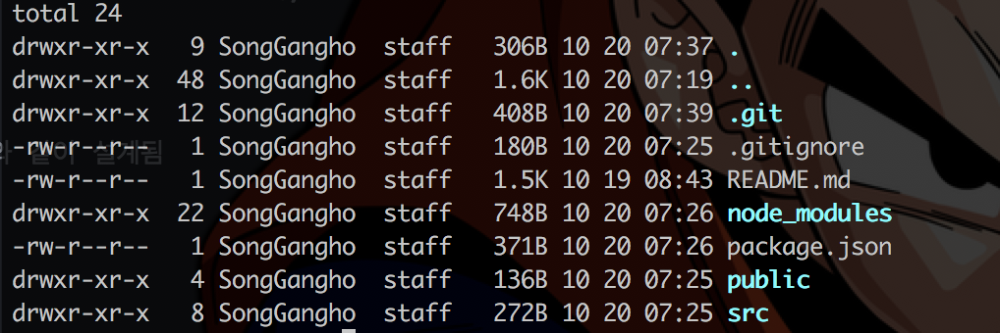
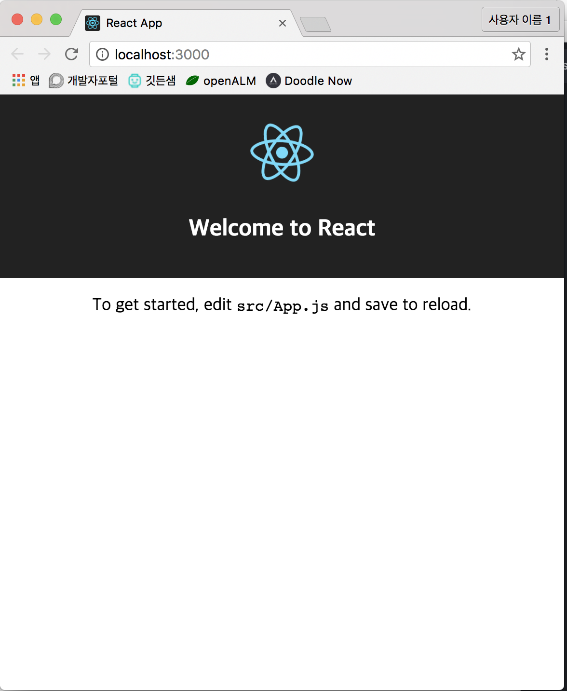
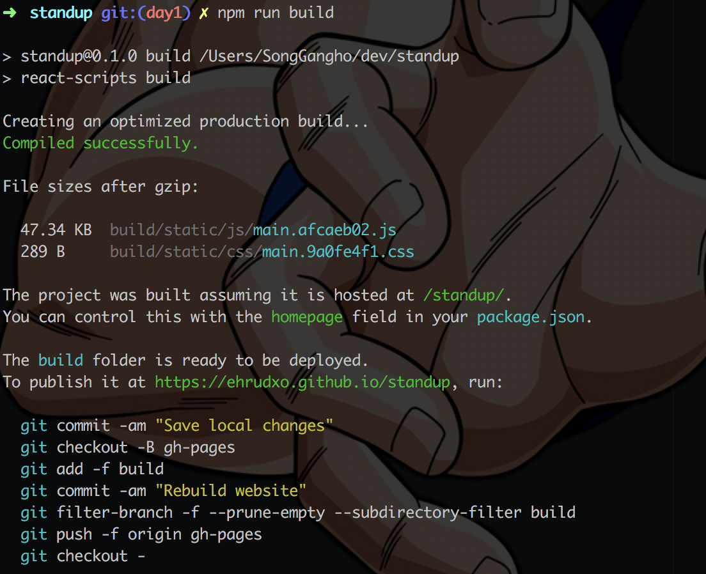
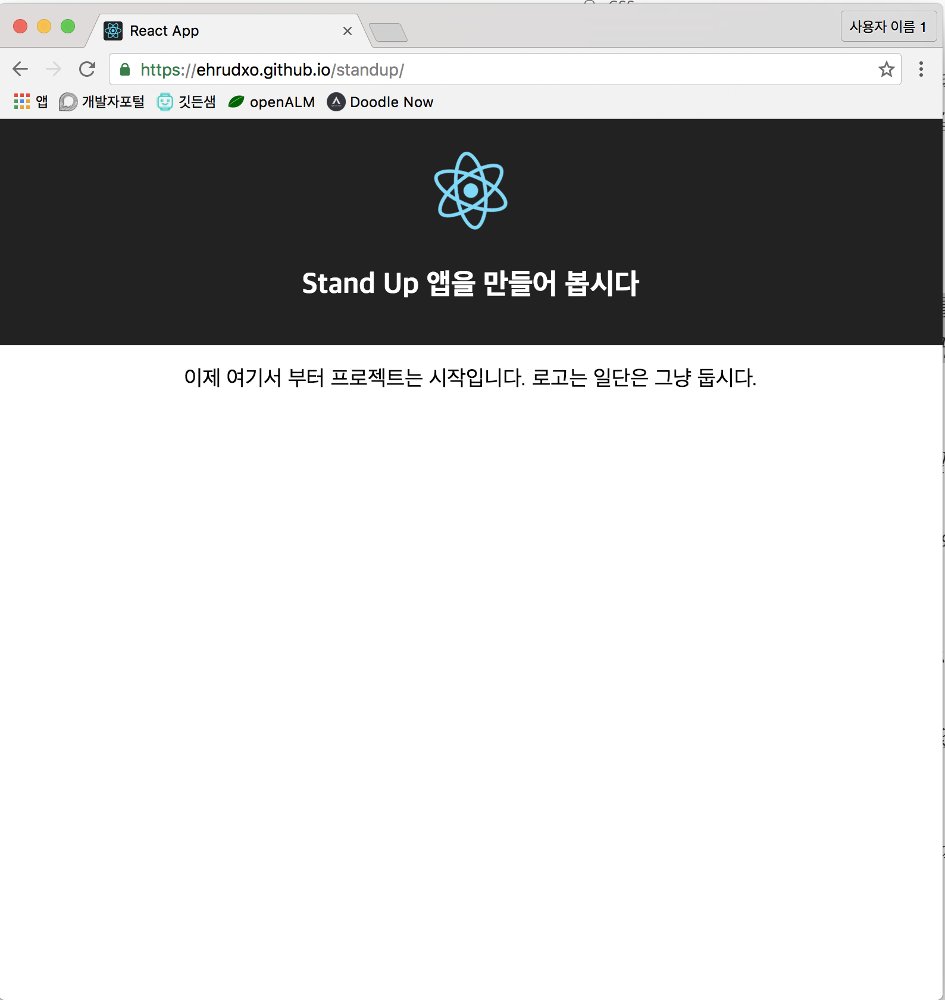

# Day1

첫 번째 날은 User Story 1 번에 관해서 진행하겠습니다.
```
김개발은 아침 스탠드업 시간에 같이 이야기를 나눌 수 있는 주제를 위해 스탠드업이라는 웹 앱을 찾아간다. 이렇게 함으로써 사람들과 IT에 대한 주제로 커뮤니케이션을 할 수 있다.
```

## create-react-app

github에 프로젝트를 만들고 로칼에 디렉토리를 standup 이라는 이름을 만들었으면 이제는 프로젝트 셋팅을 해야겠죠.
react의 boilerplate를 자동으로 만들어 주는 create-react-app을 이용하도록 하겠습니다.
create-react-app은 관련된 내용을 서두에 얘기해 두었으니 참조하세요.

* create-react-app 설치
```
$npm install create-react-app -g //글로발 옵션
```

* 디렉토리에 create-react-app 설정

create-react-app [폴더]를 지정하면 됩니다.

지금과 같이 standup 폴더를 만든 경우는 아래와 같이 실행하면 됩니다.
```
$cd standup && create-react-app .
```

다만 이런 과정에서 미리 만들어 둔 README.md파일을 README.old.md 파일로 만들고 create-react-app의
README.md파일을 생성하는 만행을 저지릅니다. 그래서 아래와 같이 응징
```
$rm README.md && mv README.old.md README.md
```

이렇게 해도 상관 없는 것은 언제나 create-react-app 프로젝트를 방문하면 새로 업데이트 된 따끈따끈한 README.md
파일을 볼 수 있기 때문입니다.

이쯤에서 저는 git branch를 새로 day1을 만들도록 하겠습니다.
```
$git branch day1 && git checkout day1 && ls -al
```



와 같은 결과가 나옵니다.

* 프로젝트 실행

```
$npm start
```
를 통해 프로젝트를 실행해 볼 수 있고 아래와 같은 화면을 볼 수 있습니다.
한 단계 산은 넘었군요.



## gh-pages

User Story 1번을 한번 확인해 보도록 하겠습니다.
```
1. 김개발은 아침 스탠드업 시간에 같이 이야기를 나눌 수 있는 주제를 위해 스탠드업이라는 웹 앱을 찾아간다. 이렇게 함으로써 사람들과 IT에 대한 주제로 커뮤니케이션을 할 수 있다.
```
웹 앱을 찾아간다 라는 부분이 있습니다.

찾아가려고 하면 사람들이 외부에서 참조할 수 있는 사이트 링크가 있어야 하겠죠. 다행히 깃헙은 이런 페이지의 웹 호스팅을 지원합니다.

만들어 놓은 깃헙 프로젝트에 gh-pages라는 브랜치를 만들어서 푸쉬를 하면

```
https://[사용자명].gihub.io/[프로젝트명]
```
에 deploy가 됩니다.

제 경우는
```
https://ehrudxo.github.io/standup
```
이 되겠죠.

그런데, 이것을 아주 간단하게 해 주는 방법이 있습니다.

Node에는 gh-pages라는 모듈이 존재합니다.

```
$npm install gh-pages --save
```

이렇게 하고 gh-pages 명령어를 통해 바로 실행할 수도 있는데, 자동화를 위해 몇가지 작업을 하겠습니다.

프로젝트 최상위에 존재하는 package.json파일을 열어 봅니다.
```json
{
  "name": "standup",
  "version": "0.1.0",
  "private": true,
  "devDependencies": {
    "react-scripts": "0.6.1"
  },
  "dependencies": {
    "gh-pages": "^0.11.0",
    "react": "^15.3.2",
    "react-dom": "^15.3.2"
  },
  "scripts": {
    "start": "react-scripts start",
    "build": "react-scripts build",
    "test": "react-scripts test --env=jsdom",
    "eject": "react-scripts eject"
  }
}
```
처럼 들어가 있을 텐데요.

```
"homepage" : "https://[사용자명].gihub.io/[프로젝트명]",
```
를 추가하고 스크립트를 하나 추가하겠습니다.

```
"deploy": "gh-pages -d build"
```
homepage를 추가하는 것은 create-react-app에서 빌드를 할 때 경로를 확인하게 하기 위함이고,
deploy 스크립트를 추가하는 것은 자동화를 위함입니다.

즉, create-react-app 으로 앱을 production 단계로 빌드해서 gh-pages 를 통해서 디플로이 하는 Continuous Integration
용 명령어를 추가한 것입니다.

최종 package.json 파일은 아래와 같은 형태를 취하게 됩니다.
```json
{
  "name": "standup",
  "version": "0.1.0",
  "private": true,
  "homepage" : "https://ehrudxo.github.io/standup //변경하시고. 주석은 삭제하세요.",
  "devDependencies": {
    "react-scripts": "0.6.1"
  },
  "dependencies": {
    "gh-pages": "^0.11.0",
    "react": "^15.3.2",
    "react-dom": "^15.3.2"
  },
  "scripts": {
    "start": "react-scripts start",
    "build": "react-scripts build",
    "test": "react-scripts test --env=jsdom",
    "eject": "react-scripts eject",
    "deploy": "gh-pages -d build"
  }
}
```
## 페이지 변경

소스 변경 없이 올리면 너무 썰렁할 테니 대문을 조금 바꾸도록 하겠습니다.

public 폴더 아래의 index.html의 title을 아래와 같이 바꿔주시고

```html
<!doctype html>
<html lang="en">
  <head>
    <meta charset="utf-8">
    <meta name="viewport" content="width=device-width, initial-scale=1">
    <link rel="shortcut icon" href="%PUBLIC_URL%/favicon.ico">
    <title>Stand Up!</title>
  </head>
  <body>
    <div id="root"></div>
  </body>
</html>
```

src 폴더 아래의 App.js파일은 다음과 같이 바꿔 줍시다.
```js
import React, { Component } from 'react';
import logo from './logo.svg';
import './App.css';

class App extends Component {
  render() {
    return (
      <div className="App">
        <div className="App-header">
          
          <h2>Stand Up 앱을 만들어 봅시다</h2>
        </div>
        <p className="App-intro">
          이제 여기서 부터 프로젝트는 시작입니다. 로고는 일단은 그냥 둡시다.
        </p>
      </div>
    );
  }
}

export default App;
```
## 빌드
이제 다음 명령어를 치면 production 레벨의 빌드단계를 거치게 됩니다.
```
$npm run build
```
아마 build 폴더를 만들면서 아래와 같은 화면을 보여줄 것입니다.



build 폴더 아래에는 static 한 파일들과 함께 배포용 파일들이 셋팅되어 있습니다.

## 배포
아까 만들었던 스크립트를 활용해서
```
 $npm run deploy
```
명령어를 입력하면 그림과 같이 내가 만든 페이지가 깃헙 호스팅 페이지에 배포 되었습니다!

놀랍죠.
다음 번엔 User Story2 번을 3번에 나눠서 만들어 보도록 하겠습니다.
